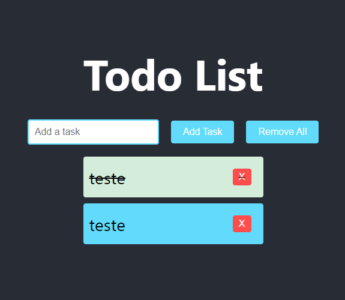

# To-Do List

## Descrição
Uma aplicação simples de lista de tarefas onde o usuário pode adicionar, marcar como concluída e deletar tarefas.

## Funcionalidades
- Adicionar tarefa
- Marcar/desmarcar como concluída
- Remover tarefa
- Remover todas as tarefas

## Objetivo
Familiarizar-se com os conceitos básicos do React, como componentes, estados e eventos.

## Imagem da Aplicação
